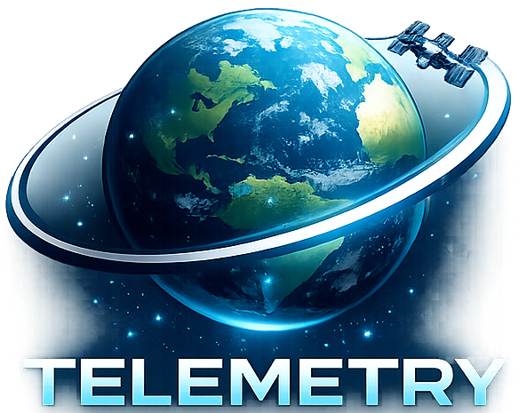
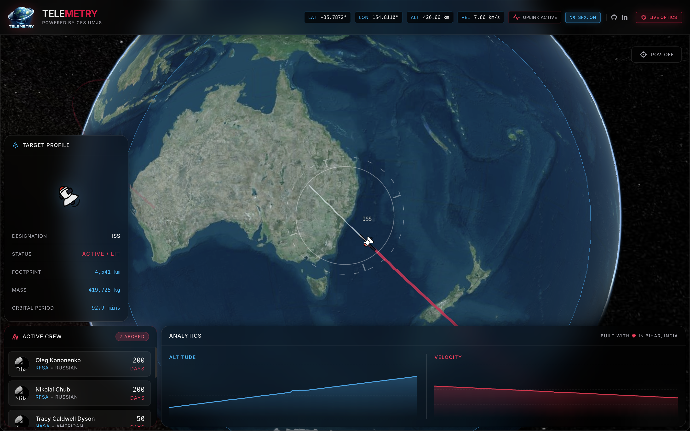

  
  <h1>TELEMETRY</h1>
  
A real-time International Space Station tracking and telemetry platform.

   
  

## Overview

TELEMETRY is a web-based aerospace dashboard designed to track the International Space Station in real-time. Instead of presenting raw numbers, this platform transforms complex telemetry data into a highly visual, futuristic Heads-Up Display (HUD) inspired by mission control centers.

## Features

- Real-Time 3D Orbital Tracking: A live 3D globe rendering the current position and orientation of the ISS.
- Live Telemetry Analytics: Dynamic charts graphing the altitude and velocity of the station over time.
- Cinematic Point-of-View: A camera mode that locks onto the station and points straight down at Earth, simulating the view from orbit.
- Active Crew Manifest: A live, constantly syncing roster of the astronauts currently aboard the station, including their agency and days in space.
- Immersive Audio Design: Ambient telemetry pinging and cinematic fly-in sound effects to enhance the mission control atmosphere.
- Live Optics Feed: A drop-down NASA live stream directly integrated into the HUD.

## Technical Details

This project is built as a single-page application focused on high-performance geospatial rendering and sleek user interface design.

Core Technologies:

- React.js: The core framework used to build the component-based architecture.
- Vite: The build tool and development server.
- CesiumJS: A powerful WebGL-based geospatial 3D globe engine used to render Earth, atmospheric scattering, and the predicted orbital trajectory ribbon.
- TailwindCSS: Used for creating the dark-mode glassmorphism aesthetics and responsive flexbox layouts.
- Framer Motion: Powers the micro-animations, smooth element rendering, and dropdown interactions.
- Recharts: Renders the live area charts for the telemetry analytics panel.
- Lottie-Web: Used to render a high-quality animated vector graphic of the satellite directly onto the 3D globe.

Data Sources (Live APIs):

- wheretheiss.at REST API: Provides live position, velocity, and footprint radius.
- The Space Devs / Open-Notify: Provides the live crew manifest data.

## Getting Started

To run this project locally on your machine:

1. Clone the repository.
2. Install the dependencies by running `npm install` in the project directory.
3. Start the development server by running `npm run dev`.
4. Open your browser and navigate to the local host address provided in the terminal.

Built in Bihar, India.
